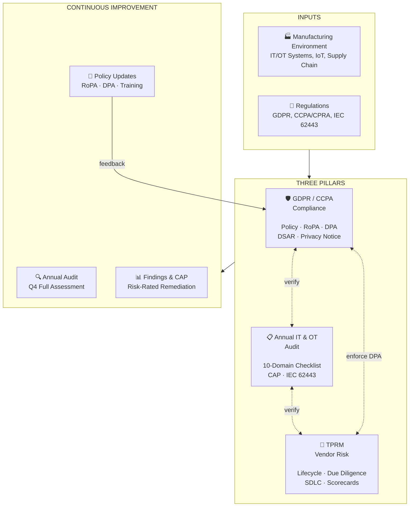

# IT Compliance Framework — Manufacturing

**Wonhee Richard Lee** | Senior Cloud Systems Administrator

This repository publicly documents the **GDPR/CCPA Compliance**, **Annual IT & OT Audit**, and **TPRM (Third-Party Risk Management)** frameworks built at Sena Technologies. It serves as verifiable evidence for the compliance experience listed on my resume.

---

## Framework Architecture

## Key Achievements

- **GDPR/CCPA Framework** — Designed and implemented the full compliance architecture during IPO preparation, covering IT/OT systems, global supply chain data flows, and employee biometric data. Achieved 20–25% cloud cost reduction while maintaining compliance posture.
- **Annual IT Audit** — Designed and led integrated IT & OT audit programs covering GDPR/CCPA, Zero-Trust controls, and IEC 62443 operational technology security.
- **TPRM** — Led vendor security assessment for the Bose project, achieving "Trusted Software Developer Partner" status and unlocking a multi-million dollar partnership.

---

## Repository Sections

| Section | Description |
|---------|-------------|
| [GDPR & CCPA](./gdpr-ccpa/) | Policy templates, RoPA, Data Mapping, DPA, DSAR procedure |
| [Annual IT Audit](./it-audit/) | Audit program, 10-domain checklist, report template, CAP tracker, OT/IEC 62443 |
| [TPRM](./tprm/) | Vendor lifecycle framework, tiering matrix, due diligence questionnaire, secure SDLC checklist |
| [Evidence](./evidence/) | Anonymized artifacts — audit findings, TPRM case study, compliance dashboard |
| [Resources](./resources/) | Glossary, reference standards, tooling recommendations |
| [Docs](./docs/) | Framework overview, manufacturing-specific use cases |

---

## Manufacturing Focus Areas

- **IT/OT Convergence** — Privacy and security controls spanning enterprise IT (ERP, CRM, HRIS) and operational technology (MES, PLC/SCADA, IoT sensors)
- **Global Supply Chain** — Cross-border data flows with EU-US DPF/SCC compliance, multi-tier vendor data sharing
- **Zero-Trust Architecture** — Intune + Okta integration with RBAC, MFA, and conditional access across factory and cloud environments
- **Cloud Cost Optimization** — Compliance-aligned cloud architecture reducing infrastructure spend by 20–25%

---

## Quick Links

- [GDPR/CCPA Policy Template](./gdpr-ccpa/policy-template.md)
- [Annual IT Audit Checklist](./it-audit/audit-checklist.md)
- [TPRM Vendor Lifecycle Framework](./tprm/tprm-framework.md)
- [Manufacturing Data Flow Examples](./gdpr-ccpa/data-mapping-example.md)

---

## About This Repository

This repository is part of my professional portfolio. All content is based on real methodologies developed and implemented in a manufacturing environment. Company names and specific data have been anonymized or fictionalized.

**Disclaimer**: These documents are reference frameworks and general guidance. They do not constitute legal advice. Always consult qualified legal counsel and data protection professionals for your specific compliance needs.

---

**Portfolio**: [project.techcloudup.com](https://project.techcloudup.com)  
**Contact**: wonhee.eng@gmail.com  
**LinkedIn**: [linkedin.com/in/wonheelee](https://linkedin.com/in/wonheelee)
