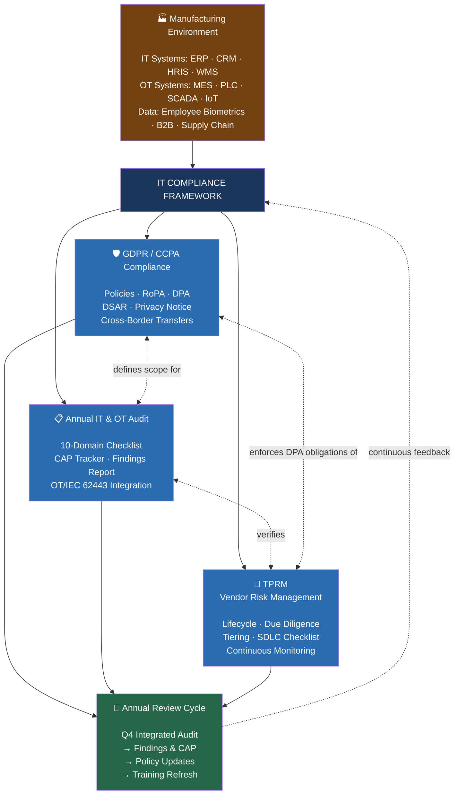

# IT Compliance Framework — Overview

> **Repository**: [scale600/it-compliance-framework](https://github.com/scale600/it-compliance-framework)  
> **Author**: Wonhee Richard Lee  
> **Version**: 1.0

---

## What This Framework Covers

This repository documents a comprehensive **IT Compliance Framework** designed for US-based manufacturing companies that must comply with GDPR, CCPA/CPRA, implement annual IT/OT audits, and manage third-party vendor risk — particularly with software development partners.

The framework is organized into three interconnected pillars forming a continuous improvement cycle:

### How the Pillars Connect

| Pillar | Primary Output | Input to |
|--------|---------------|----------|
| **GDPR/CCPA** | RoPA, Privacy Policy, DPA, DSAR Procedure | Defines what the Audit verifies; Defines TPRM contract requirements |
| **Annual IT Audit** | Findings Report, CAP Tracker, Maturity Score | Verifies GDPR/CCPA compliance; Verifies TPRM effectiveness; Drives policy updates |
| **TPRM** | Vendor Tiering, Due Diligence, DPA Compliance | Subject to Audit (Domain 9); Contractually enforces GDPR/CCPA processor obligations |

---

## Who This Framework Is For

- **IT/OT leaders** at manufacturing companies building a compliance program
- **Privacy Officers / DPOs** implementing GDPR/CCPA in an industrial environment
- **CISOs** designing integrated IT/OT audit programs
- **Procurement and Legal teams** managing vendor risk and DPA compliance
- **Compliance professionals** seeking manufacturing-specific templates and methodologies
- **Hiring managers** evaluating compliance experience (this repository backs resume claims)

---

## Framework Design Principles

1. **Manufacturing Reality** — Every template, checklist, and procedure accounts for OT/IoT environments, factory floor constraints, and supply chain complexity. This is not a generic privacy framework adapted to manufacturing — it was built in manufacturing.

2. **Operational, Not Theoretical** — All documents are designed for immediate use. Checklists are actionable. Templates include real examples. Procedures have defined SLAs and owners.

3. **Integrated, Not Siloed** — The three pillars are designed to work together. The annual audit verifies what the privacy program defines. The TPRM program enforces what the DPA requires. Findings from one pillar drive updates in the others.

4. **Evidence-Driven** — Every control has a verification method. Every finding has a CAP with a due date. Every claim has evidence.

5. **Scalable** — The framework works for a single-factory operation using spreadsheets, and scales to multi-site enterprises using GRC platforms.

---

## Getting Started

### For Practitioners

1. Start with the [GDPR/CCPA Policy Template](../gdpr-ccpa/policy-template.md) — this defines your compliance baseline
2. Build your [RoPA](../gdpr-ccpa/ropa-template.md) — you can't protect what you don't know you have
3. Use the [Annual Audit Checklist](../it-audit/audit-checklist.md) — this will tell you where you stand today
4. Implement [TPRM](../tprm/tprm-framework.md) for any vendor touching PII — this is where most breaches originate

### For Evaluators (Hiring Managers / Recruiters)

This repository demonstrates:
- **GDPR/CCPA**: Policy design, RoPA structure, data mapping methodology, DSAR process, cross-border transfer mechanisms
- **IT Audit**: Audit program design, multi-domain checklist, risk-based methodology, CAP tracking, OT/IEC 62443 integration
- **TPRM**: Vendor lifecycle management, risk tiering, due diligence questionnaire, secure SDLC assessment, DPA contracting

The [Evidence](./evidence/) folder provides anonymized examples of actual work products: a vendor security assessment case study, compliance dashboard design, and audit findings with remediation tracking.

---

## Document Index

### GDPR & CCPA Compliance
| Document | Description |
|----------|-------------|
| [policy-template.md](../gdpr-ccpa/policy-template.md) | Full GDPR/CCPA privacy policy template (11 sections) |
| [ropa-template.md](../gdpr-ccpa/ropa-template.md) | Record of Processing Activities with 6 manufacturing examples |
| [data-mapping-example.md](../gdpr-ccpa/data-mapping-example.md) | 5 Mermaid diagrams: supply chain, IoT, HR, B2B, cross-border |
| [privacy-notice.md](../gdpr-ccpa/privacy-notice.md) | Customer/employee-facing privacy notice |
| [dpa-template.md](../gdpr-ccpa/dpa-template.md) | Standard Data Processing Agreement with Schedules |
| [dsar-procedure.md](../gdpr-ccpa/dsar-procedure.md) | End-to-end DSAR intake, verification, and fulfillment process |

### Annual IT & OT Audit
| Document | Description |
|----------|-------------|
| [annual-audit-program.md](../it-audit/annual-audit-program.md) | Audit methodology, 10 domains, risk rating, timeline |
| [audit-checklist.md](../it-audit/audit-checklist.md) | 85-item checklist across 10 domains |
| [audit-report-template.md](../it-audit/audit-report-template.md) | Standard report structure with finding detail format |
| [cap-tracker.md](../it-audit/cap-tracker.md) | CAP management: tracking, escalation, closure verification |
| [ot-iec62443-notes.md](../it-audit/ot-iec62443-notes.md) | OT/IoT audit procedures aligned with IEC 62443 |

### TPRM — Vendor Risk Management
| Document | Description |
|----------|-------------|
| [tprm-framework.md](../tprm/tprm-framework.md) | Full vendor lifecycle: Selection → Contracting → Monitoring → Offboarding |
| [vendor-tiering-matrix.md](../tprm/vendor-tiering-matrix.md) | Risk scoring model, tier definitions, due diligence by tier |
| [due-diligence-questionnaire.md](../tprm/due-diligence-questionnaire.md) | 10-section vendor assessment questionnaire |
| [standard-dpa-template.md](../tprm/standard-dpa-template.md) | Software developer-specific DPA annex |
| [software-developer-checklist.md](../tprm/software-developer-checklist.md) | 65-item SDLC and security assessment checklist |

### Evidence & Resources
| Document | Description |
|----------|-------------|
| [bose-tprm-summary.md](../evidence/bose-tprm-summary.md) | Anonymized case study: Vendor assessment for Trusted Partner qualification |
| [compliance-dashboard.md](../evidence/compliance-dashboard.md) | Executive dashboard design with KRI/KPI metrics |
| [audit-findings-example.md](../evidence/audit-findings-example.md) | 5 anonymized findings demonstrating format and depth |
| [glossary.md](../resources/glossary.md) | A–Z glossary of compliance, security, and OT terminology |
| [references.md](../resources/references.md) | Laws, standards, frameworks, tools, and publications |

---

## About the Author

**Wonhee Richard Lee** — Senior Cloud Systems Administrator with deep experience in manufacturing IT/OT compliance. This framework was developed and refined at Sena Technologies, where responsibilities included:

- Designing and implementing GDPR/CCPA compliance architecture during IPO preparation
- Leading annual IT & OT integrated audits across factory and cloud environments
- Managing TPRM for software development partners, including the Bose Trusted Developer assessment

**Contact**: wonhee.eng@gmail.com  
**Portfolio**: [project.techcloudup.com](https://project.techcloudup.com)  
**LinkedIn**: [linkedin.com/in/wonheelee](https://linkedin.com/in/wonheelee)

---

**Disclaimer**: This framework is provided for informational and reference purposes. It does not constitute legal advice. Organizations should engage qualified legal counsel and data protection professionals for their specific compliance needs.
