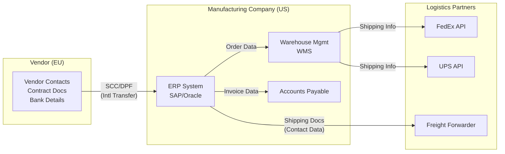
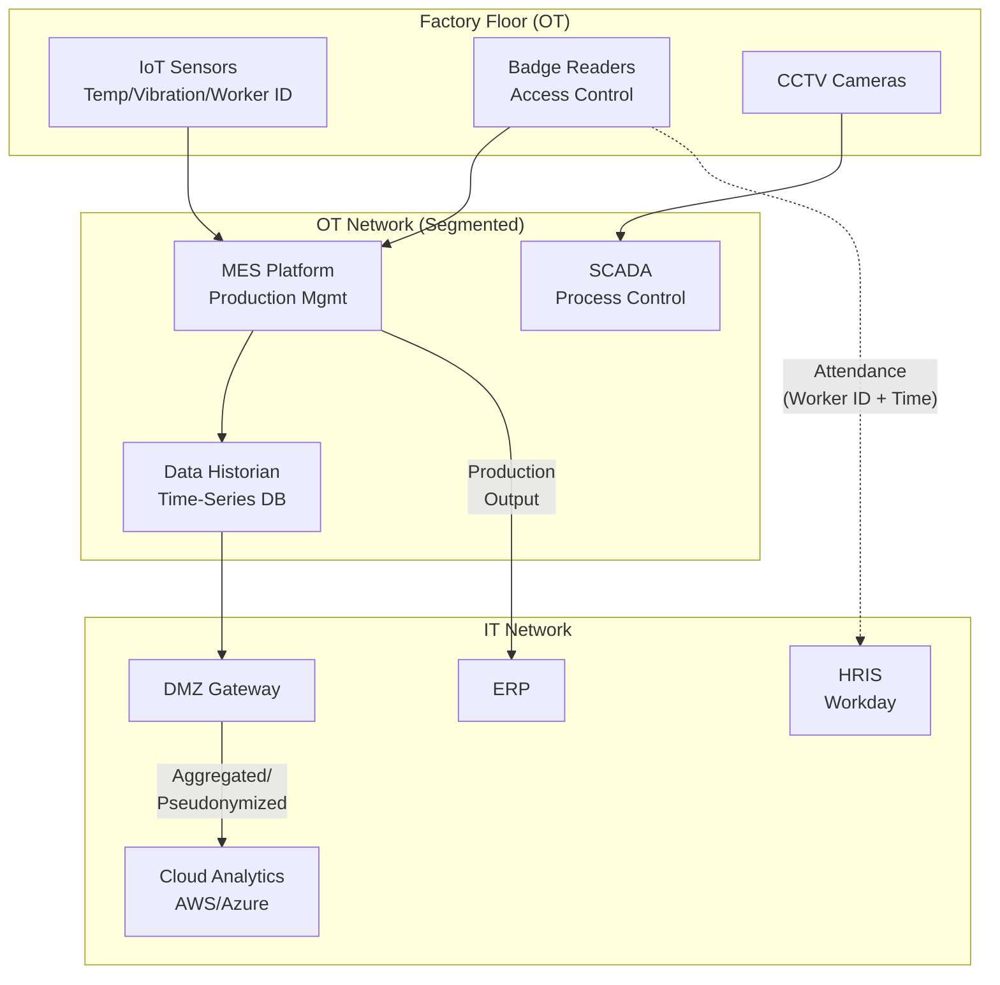
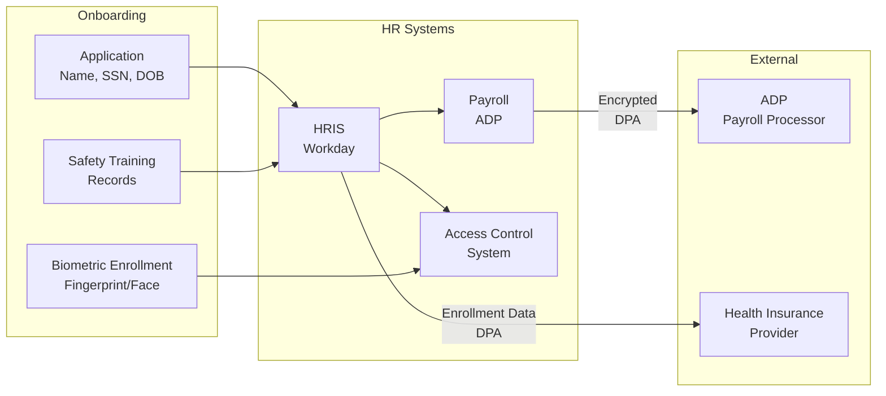
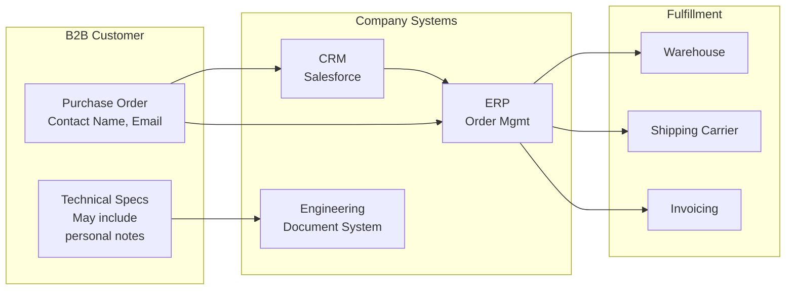
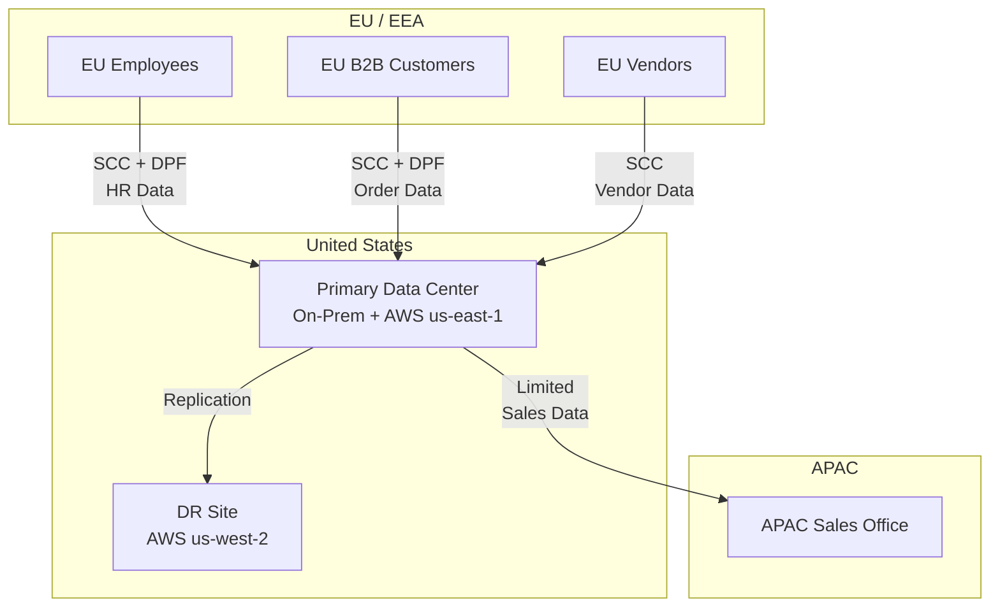

# Manufacturing Data Flow Examples

> **Purpose**: Visualize key PII data flows in a manufacturing environment from collection through processing, storage, and sharing — including IT/OT convergence points.
> **Tooling**: Diagrams rendered in Mermaid (GitHub-compatible). Export to PNG via draw.io for presentations.

---

## 1. Supply Chain Data Flow

**Key Compliance Points**:
- EU vendor data enters US ERP → SCC or DPF required
- Logistics partners receive only necessary shipping data (data minimization)
- Vendor bank details stored encrypted in AP; access restricted to Finance

---

## 2. Production Line IoT Data Flow (OT-IT Convergence)

**Key Compliance Points**:
- OT network is air-gapped from IT; DMZ gateway enforces data filtering
- Worker ID data pseudonymized before reaching Cloud Analytics
- Raw biometric data stays on-prem; only hashed references cross to HRIS
- CCTV footage stays on OT network; accessed only via jump host with MFA

---

## 3. Employee HR & Biometric Data Flow

**Key Compliance Points**:
- Biometric data stored only in Access Control System (not in HRIS) — data minimization
- ADP and Insurance receive data under DPA with encryption
- Biometric consent obtained at enrollment; revocation triggers deletion within 30 days
- Safety training records retained per OSHA requirements (employment + 5 years)

---

## 4. B2B Customer Order Processing

**Key Compliance Points**:
- B2B contacts: primarily "business card" data; GDPR still applies if EU individuals
- Technical specs reviewed for embedded personal data before archival
- No sale/sharing of B2B customer data (CCPA)
- Retention: contract duration + 5 years per tax requirements

---

## 5. Cross-Border Data Transfer Map

**Transfer Safeguards**:

| Transfer Path | Mechanism | TIA Completed |
|--------------|-----------|---------------|
| EU → US (Employee Data) | SCC (Module 2) + DPF | Yes |
| EU → US (Customer Data) | SCC (Module 2) + DPF | Yes |
| EU → US (Vendor Data) | SCC (Module 3) | Yes |
| US → APAC (Sales) | SCC (Module 1) | Yes |

---

## Data Flow Documentation Standards

All data flow diagrams should include:

- [ ] All systems that touch personal data
- [ ] Direction of data movement (arrows)
- [ ] Cross-border transfer points (marked with applicable safeguard)
- [ ] Encryption status (at rest / in transit)
- [ ] Access control boundaries (network segments)
- [ ] Version number and last review date

> **Diagrams below are rendered using Mermaid. GitHub natively supports Mermaid rendering in Markdown files. For presentations, export via [Mermaid Live Editor](https://mermaid.live) or draw.io.**
