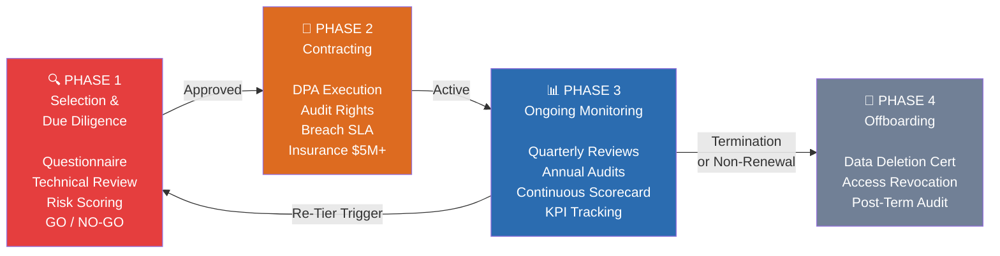

# Third-Party Risk Management (TPRM) Framework

> **Version**: 1.0 | **Classification**: Internal — Confidential  
> **Policy Owner**: CISO + Procurement + Legal  
> **Last Reviewed**: [Date] | **Next Review**: [Date + 1 Year]

---

## 1. Purpose & Scope

### 1.1 Purpose

This TPRM Framework establishes the lifecycle governance for all third-party vendors, with a specific focus on **Trusted Software Developer Partners** who access, process, or develop systems handling Personal Data (PII) or Operational Technology (OT) data. The framework ensures:

- Compliance with GDPR Article 28 (Processor obligations) and CCPA Service Provider requirements
- Protection of sensitive manufacturing data (employee biometrics, supply chain data, production logs)
- Vendor-originated breach risk minimization
- Audit readiness for regulatory and customer assessments

### 1.2 Scope

| In Scope | Out of Scope |
|----------|-------------|
| Software developers (custom ERP/MES, IoT platforms, analytics, cloud) | Commodity suppliers (raw materials — unless they process PII) |
| SaaS providers hosting/processing PII | Office supplies / non-IT services |
| Cloud infrastructure providers (AWS, Azure) | Janitorial / facilities (unless they access secure areas) |
| Logistics partners receiving customer/shipping data | |
| Payroll/HR processing vendors | |
| Any vendor with logical or physical access to PII | |

---

## 2. Vendor Lifecycle



---

## 3. Phase 1: Selection & Due Diligence

### 3.1 Trusted Software Developer Partner Criteria

To qualify as a **Trusted Partner**, vendors must demonstrate:

| Criterion | Requirement |
|-----------|------------|
| **Certifications** | ISO 27001, SOC 2 Type II, or equivalent. GDPR/CCPA compliance program evidence. |
| **Security Program** | Designated DPO or Security Officer. Documented incident response. Breach notification SLA ≤ 48 hours. |
| **Manufacturing Domain** | Experience with OT/IoT security, IEC 62443, industrial protocols. References from manufacturing clients. |
| **Secure Development** | Documented SDLC with security gates (SAST, DAST, dependency scanning). OWASP Top 10 awareness. |
| **Financial Stability** | Cyber Liability Insurance ≥ $5M. Financial statements or D&B rating. |

### 3.2 Due Diligence Process

```
┌─────────────┐     ┌─────────────┐     ┌──────────────┐     ┌─────────────┐
│  Vendor      │     │  Technical  │     │  Risk         │     │  GO /       │
│  Questionnaire│───▶│  Review     │───▶│  Scoring      │───▶│  NO-GO      │
│  (self-attest)│    │  (evidence) │     │  (0-100)     │     │  Decision   │
└─────────────┘     └─────────────┘     └──────────────┘     └─────────────┘
```

**Risk Scoring Model (0–100):**

| Dimension | Weight | Assessment Criteria |
|-----------|--------|-------------------|
| PII/Data Exposure | 40% | Volume, sensitivity, access level (read/write/admin), data subject count |
| Security Maturity | 30% | Certifications, pen test results, vulnerability program, incident history |
| Financial Stability | 10% | Revenue, years in business, insurance coverage |
| Reputation & References | 20% | Client references, public breach history, legal/regulatory actions |

**Risk Tier Assignment:**

| Score Range | Tier | Treatment |
|------------|------|-----------|
| 0–40 | **High Risk (Tier 1)** | Enhanced due diligence, annual on-site audit, quarterly reviews, CISO approval required |
| 41–70 | **Medium Risk (Tier 2)** | Standard due diligence, annual remote audit, biannual reviews |
| 71–100 | **Low Risk (Tier 3)** | Simplified due diligence, annual questionnaire, triennial audit |

> See [Vendor Tiering Matrix](./vendor-tiering-matrix.md) for detailed criteria.

### 3.3 Due Diligence Questionnaire

All high/medium-risk vendors must complete the [Due Diligence Questionnaire](./due-diligence-questionnaire.md). Minimum coverage:

- Data processing scope and sub-processor inventory
- Security certifications and audit history
- Breach notification process and last 3-year incident history
- Secure SDLC practices (for software developers)
- Business continuity and disaster recovery

---

## 4. Phase 2: Contracting

### 4.1 Required Contractual Provisions

All vendor contracts involving PII processing must include:

| Clause | Requirement | Reference |
|--------|------------|-----------|
| **Data Processing Agreement (DPA)** | Mandatory for all PII processors | [Standard DPA Template](../gdpr-ccpa/dpa-template.md) |
| **Processing Instructions** | Only on documented instructions from Company | GDPR Art. 28(3)(a) |
| **CCPA Service Provider** | Prohibition on sale/sharing; limited use; no combination of data | CCPA § 1798.140 |
| **Audit Rights** | Annual + for-cause audit at Company's or delegate's discretion | |
| **Sub-Processor Approval** | Prior written consent; same DPA obligations imposed | GDPR Art. 28(2) |
| **Breach Notification** | Within ≤ 48 hours of discovery | |
| **Data Return/Deletion** | Within 30 days of termination; Certificate of Deletion required | |
| **Liability & Indemnification** | Vendor liable for breach-related fines, penalties, and remediation costs | |
| **International Transfers** | SCC/DPF incorporated where applicable | |
| **Insurance** | Cyber Liability minimum $5M per occurrence | |

### 4.2 Software Developer-Specific Clauses

| Clause | Purpose |
|--------|---------|
| **Code Ownership & IP** | Company retains ownership of custom-developed code and all derivative works |
| **Backdoor Prohibition** | No undisclosed access mechanisms, telemetry, or data exfiltration |
| **Secure SDLC Obligation** | Adherence to OWASP SAMM or equivalent; security gates at each SDLC phase |
| **Code Escrow** (critical systems) | Source code deposited with neutral third party; release triggers defined |
| **Developer Access Controls** | Least privilege; session logging for all PII access; background checks |
| **Change Management** | Privacy Impact Assessment for any change affecting PII processing |

> See [Software Developer Checklist](./software-developer-checklist.md) for detailed verification criteria.

---

## 5. Phase 3: Ongoing Monitoring & Management

### 5.1 Monitoring Cadence by Tier

| Activity | Tier 1 (High) | Tier 2 (Medium) | Tier 3 (Low) |
|----------|:---:|:---:|:---:|
| Security questionnaire | Quarterly | Biannual | Annual |
| Evidence request (pen test, audit reports) | Annual | Annual | Biannual |
| On-site/Remote audit | Annual (on-site) | Annual (remote) | Triennial |
| Performance review (SLA/KPI) | Quarterly | Biannual | Annual |
| Continuous monitoring (security scorecard) | Continuous | Continuous | — |
| Dark web / breach monitoring | Continuous | Continuous | — |

### 5.2 Key Performance Indicators (KPIs)

| KPI | Target | Measurement |
|-----|--------|------------|
| Uptime / Availability | ≥ 99.9% | Monitoring dashboard |
| Incident response time (P1) | < 4 hours | Incident tickets |
| Incident resolution time | < 24 hours (P1) | Incident tickets |
| Unauthorized PII access events | 0 | Access audit logs |
| Vulnerability remediation (Critical) | < 48 hours | Scan reports |
| DSAR support response | < 5 business days | DSAR tracker |

### 5.3 Software Developer-Specific Monitoring

| Control | Frequency | Evidence |
|---------|-----------|----------|
| Code review / SAST results | Per release | Scan reports |
| Penetration test | Annual | Pen test report |
| Dependency vulnerability scan | Monthly | SCA report |
| Developer access log review | Quarterly | Access logs |
| Change management PIA | Per major release | PIA document |
| Bug bounty program participation | Verification annually | Program status |

### 5.4 Continuous Monitoring Tools

| Tool Category | Example | Purpose |
|--------------|---------|---------|
| Security Ratings | BitSight, Security Scorecard | External security posture scoring |
| Threat Intelligence | Recorded Future, Mandiant | Breach alerts, dark web monitoring |
| Vendor Risk Platform | OneTrust, ServiceNow GRC, ProcessUnity | Centralized vendor risk lifecycle |

### 5.5 Issue Escalation

| Trigger | Escalation Path | Response Time |
|---------|----------------|---------------|
| Vendor security incident affecting Company data | CISO → Privacy Officer → CEO | Immediate (within 2 hours) |
| Critical vulnerability unpatched > 7 days | CISO → Vendor escalation | 24 hours |
| Vendor DPA non-renewal or expiration | Procurement → Legal → CISO | 48 hours |
| Vendor financial distress / bankruptcy | Procurement → CISO → CEO | 3 business days |
| Sub-processor added without approval | Privacy Officer → Legal | 24 hours |

---

## 6. Phase 4: Offboarding

### 6.1 Offboarding Triggers

- Contract termination or non-renewal
- Vendor bankruptcy or cessation of operations
- Material breach of DPA or security requirements
- Strategic decision to in-source or change providers

### 6.2 Offboarding Checklist

| # | Task | Timeline | Owner | Verified? |
|---|------|----------|-------|-----------|
| 1 | Notify vendor of termination and data return/deletion requirements | Day 0 | Procurement | ⬜ |
| 2 | Receive complete data export in standard format | Within 30 days | IT | ⬜ |
| 3 | Verify data export completeness and integrity | Within 5 days of receipt | IT + Business Owner | ⬜ |
| 4 | Revoke all access: user accounts, API keys, VPN, shared repositories | Within 24 hours of termination | IT Security | ⬜ |
| 5 | Obtain Certificate of Deletion from vendor | Within 30 days | Procurement | ⬜ |
| 6 | Verify deletion through evidence (system screenshots, auditor attestation) | Within 5 days of certificate | IT Security | ⬜ |
| 7 | Remove vendor from approved vendor list and monitoring tools | Within 5 days | TPRM Team | ⬜ |
| 8 | Post-termination audit (Tier 1 vendors) | Within 6 months | Internal Audit | ⬜ |
| 9 | Update RoPA to reflect vendor removal | Within 30 days | Privacy Office | ⬜ |
| 10 | Archive contract, DPA, and offboarding records (retention: 7 years) | Per retention policy | Legal | ⬜ |

---

## 7. Governance & Organization

### 7.1 Roles & Responsibilities

| Role | Responsibility |
|------|---------------|
| **CISO** | Overall TPRM program owner; technical risk assessment; audit oversight |
| **Privacy Officer** | DPA compliance; RoPA vendor entries; international transfer assessments |
| **Procurement** | Vendor selection RFP; contract negotiation; financial due diligence |
| **Legal** | DPA and contract review; liability and indemnification; regulatory interpretation |
| **IT Security** | Technical assessments; monitoring tools; access management |
| **Business Owners** | Vendor relationship management; performance monitoring; renewal decisions |
| **Internal Audit** | Independent verification; annual TPRM effectiveness review |

### 7.2 TPRM Committee

- **Meeting Frequency**: Quarterly
- **Attendees**: CISO, Privacy Officer, Procurement Lead, Legal, Key Business Owners
- **Standing Agenda**:
  1. New vendor onboarding approvals (Tier 1/2)
  2. High-risk vendor review (performance, incidents, audit findings)
  3. Escalated issues and remediation status
  4. Policy and process improvement proposals
  5. Upcoming renewals and offboarding

---

## 8. Integration with Annual IT Audit

The TPRM program is a core component of the [Annual IT Audit](../it-audit/annual-audit-program.md) (Domain 9 — Vendor / TPRM). Annually:

- Sample of Tier 1 vendors audited for DPA compliance
- Contract audit clauses exercised
- Vendor RoPA entries verified against actual data flows
- TPRM process effectiveness assessed

---

## 9. Tools & Templates

| Resource | Link |
|----------|------|
| Vendor Tiering Matrix | [vendor-tiering-matrix.md](./vendor-tiering-matrix.md) |
| Due Diligence Questionnaire | [due-diligence-questionnaire.md](./due-diligence-questionnaire.md) |
| Standard DPA (TPRM-specific) | [standard-dpa-template.md](./standard-dpa-template.md) |
| Software Developer Checklist | [software-developer-checklist.md](./software-developer-checklist.md) |
| General DPA Template | [../gdpr-ccpa/dpa-template.md](../gdpr-ccpa/dpa-template.md) |
| RoPA Template | [../gdpr-ccpa/ropa-template.md](../gdpr-ccpa/ropa-template.md) |

---

## 10. Implementation Roadmap (Initial Deployment)

| Month | Activities |
|-------|-----------|
| **Month 1** | Inventory all current vendors; obtain missing DPAs; perform initial risk tiering |
| **Month 2** | Standardize and deploy due diligence questionnaire; train procurement team |
| **Month 3** | Renegotiate high-risk contracts (DPA inclusion, audit rights, insurance requirements) |
| **Month 4** | Deploy monitoring tools and dashboards; establish continuous monitoring |
| **Month 5+** | Integrate into Annual IT Audit cycle; launch TPRM Committee |
| **Ongoing** | Quarterly committee meetings; annual TPRM effectiveness review |

---

## 11. References & Standards

| Standard | Application |
|----------|------------|
| ISO 27001 (Annex A.15) | Supplier relationships |
| NIST SP 800-53 (SA family) | System and Services Acquisition |
| NIST SP 800-161 | Supply Chain Risk Management |
| GDPR Art. 28 | Processor obligations |
| CCPA § 1798.140 | Service Provider definition |
| SOC 2 (CC7.2, CC9.2) | Vendor management trust criteria |
